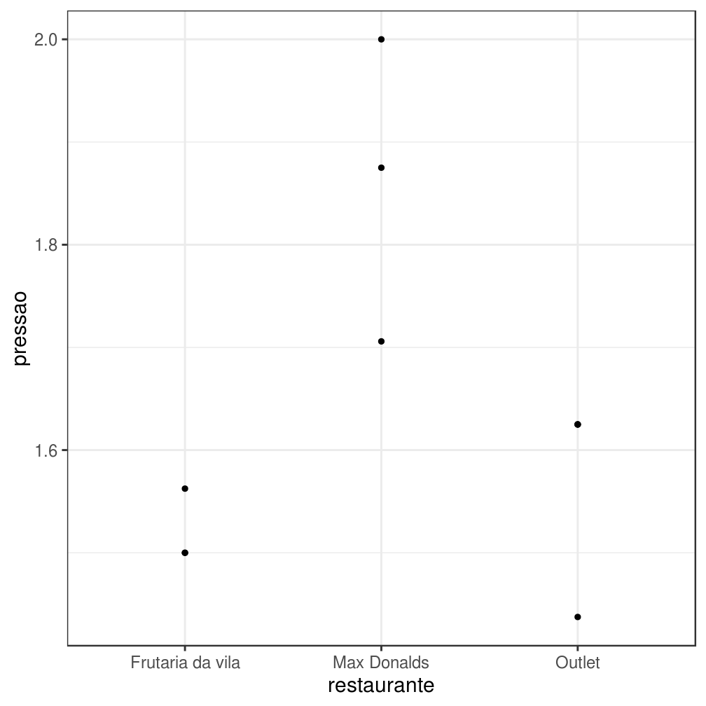
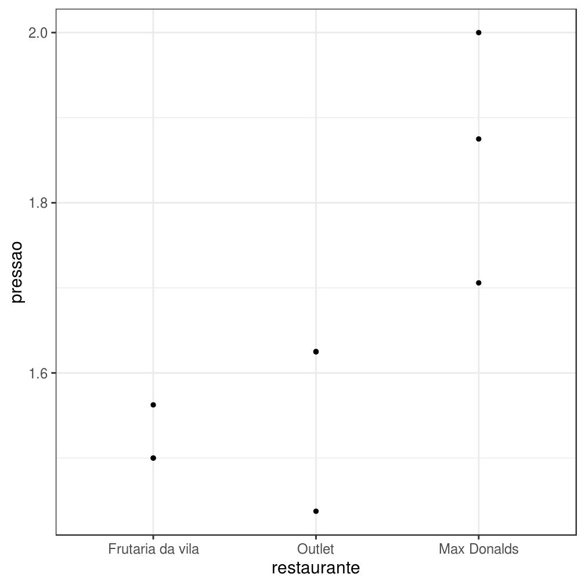
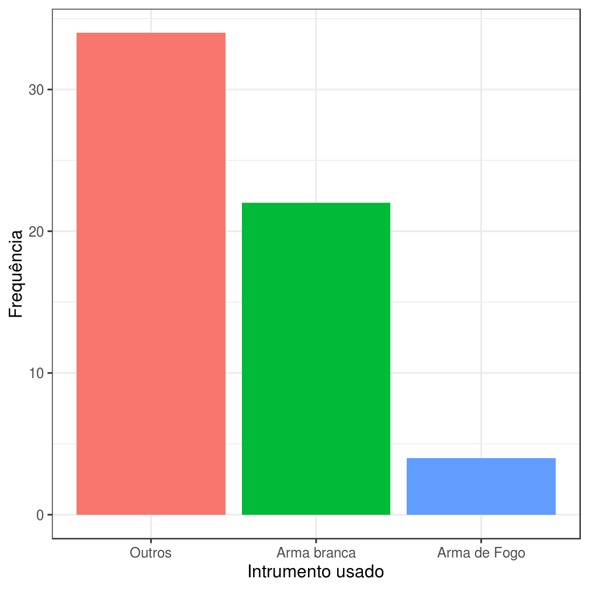
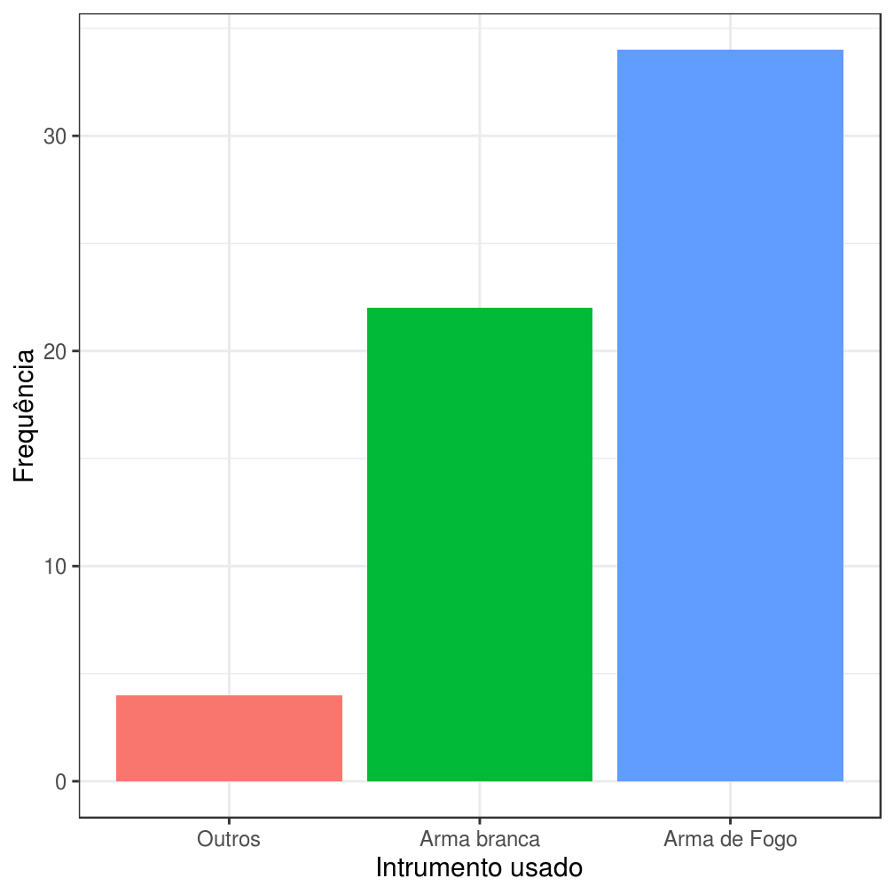
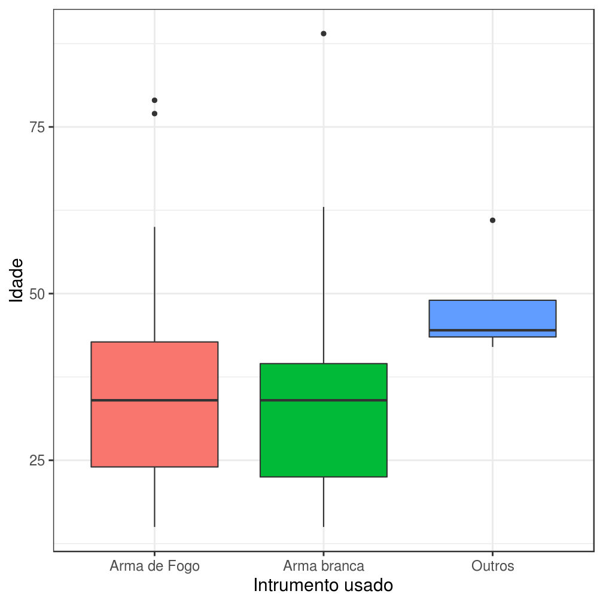
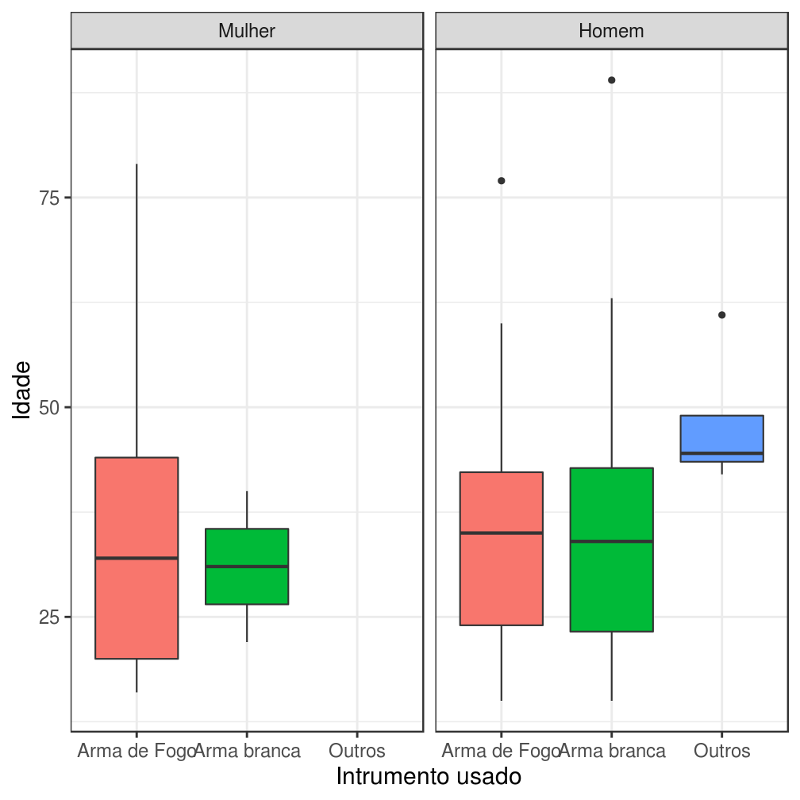
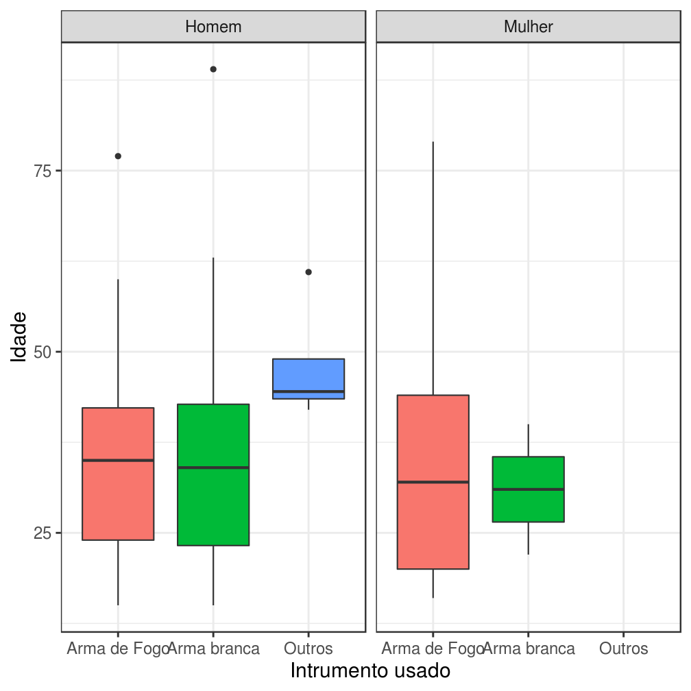

## Introdução

Se você já utilizou R anteriormente, provavelmente já escreveu a expressão `stringsAsFactors = F` quando importava dados usando as funções `read.csv` ou `read.table`. É muito frustrante quando uma coluna de `strings` é lida como um fator, pois fatores não podem ser manipulados do mesmo jeito que manipulamos vetores de `strings`.

Felizmente, depois de aprender a usar o `tidyverse` você não terá mais esse problema, pois o pacote `readr` não lê colunas de caracteres como fatores por padrão. Mas isso não significa que fatores são inúteis. Eles representam uma forma muito prática de lidar com variáveis categorizadas, tanto para fins de modelagem quanto para fins de visualização. 

Grande parte da frustração associada ao uso de fatores no R existe por conta da falta de algumas ferramentas úteis no pacote `base`. Para resolver esse o problema, Hadley Wickham ajudou a comunidade R (de novo) desenvolvendo o pacote `forcats`(**for** **cat**egorial variable**s**), que implementa algumas dessas ferramentas.

As principais funções do `forcats` servem para alterar a **ordem** e modificar os **níveis** de um fator. Para exemplificar a utilidade dessas funções, neste Power Up vamos utilizá-las em situações corriqueiras.

# Relembrando: o que são fatores?

No R, fatores são estruturas de dados utilizadas para ordenar `strings`. Formalmente, um fator é definido como um vetor de `integers` com dois atributos específicos:

- `levels`: m vetor de `strings` que indica a relação de ordem entre as variáveis.
- `class`: a `string` atômica `"factor"`.

Em modelos estatísticos clássicos, como ANOVA, é útil e adequado interpretar um vetor de textos como um vetor de números inteiros. O nome "fator", inclusive, foi definido fazendo alusão à literatura estatística.

# Para que fatores servem?

Fatores são úteis porque facilitam a ordenação de vetores de texto, principalmente quando estamos fazendo gráficos. Nesta seção, vamos exemplificar essa facilidade com um exemplo.

Considere que temos interesse em construir um gráfico que ilustre a diminuição da pressão sanguinea de um conjunto de indivíduos em função do restaurante em que acabaram de jantar. Para realizar esta tarefa, fomos à praça de alimentação de um shopping e anotamos as pressões arteriais de 10 voluntários conforme eles terminavam suas refeições nos restarantes Max Donalds, Frutaria da vila e Outlet.


O resultado das nossas medições está descrito na tabela abaixo.


| voluntario|restaurante      | pressao|
|----------:|:----------------|-------:|
|          1|Frutaria da vila |    1.56|
|          2|Max Donalds      |    1.71|
|          3|Outlet           |    1.44|
|          4|Outlet           |    1.62|
|          5|Max Donalds      |    2.00|
|          6|Outlet           |    1.62|
|          7|Frutaria da vila |    1.50|
|          8|Max Donalds      |    1.88|
|          9|Outlet           |    1.62|
|         10|Frutaria da vila |    1.50|
 
Utilizando esses dados, o gráfico desejado fica:


```r

d %>% 
ggplot(aes(x = restaurante, y = pressao)) +
  geom_point() + 
  theme_bw(15)
```



O gráfico mostra o que desejávamos, mas podemos incluir outras informações no gráfico. Se soubéssemos a priori que o Max Donalds oferece uma refeição muito mais calórica do que o Outlet, gostaríamos de atribuir essa ordem ao nosso eixo x. Como poderíamos fazer isso? Usando fatores!


```r

d %>% 
mutate(restaurante = factor(restaurante, levels = c("Frutaria da vila", "Outlet", "Max Donalds"))) %>% 
ggplot(aes(x = restaurante, y = pressao)) +
  geom_point() + 
  theme_bw(15)
```




## Estrutura básica

O `forcats` é um pacote bastante simples. Ele é composto por funções de apenas dois tipos:

- Funções que começam com `fct_`, que recebem uma lista de fatores e devolvem um fator.
    - Exemplo: `fct_c` recebe uma lista de fatores e devolve um fator que é a união dos anteriores.
    

```r

fator_1 <- factor(c("a","b","c"))
fator_2 <- factor(c("d","e"))

fator_3_sem_sentido <- c(fator_1, fator_2)

fator_3_sem_sentido
## [1] 1 2 3 1 2

fator_3_com_sentido <- forcats::fct_c(list(fator_1, fator_2))

fator_3_com_sentido
## [1] a b c d e
## Levels: a b c d e
```
    
- Funções que começam com `lvl_`, que modificam os níveis de um fator.
    - Exemplo: `lvl_revalue` recebe um fator e um vetor de `strings ` com dimensão igual ao número de níveis do fator. Retorna o fator fornecido com o atributo `levels` igual ao vetor de `strings` fornecido.
    

```r

fator <- factor(c("a","b","c"))

novos_niveis <- c("c", "b", "a")
  
fator <- forcats::lvls_revalue(fator, novos_niveis)
```

## Principais funções

Nesta seção, vamos estudar o funcionamento das principais funções do `forcats` utilizando como motivação a visualização dos dados de uma base analisada pela Associação Brasileira de Jurimetria. A base foi simplificada para otimizar seu uso neste curso. Além disso, os dados passaram por um processo de anonimização, pois os resultados ainda não foram divulgados.

A base contém informações sobre uma amostra de vítimas de homicídios no município de São Paulo e é composta pelas seguintes variáveis:

- `instrumento.usado`: instrumento usado pelo crime.
- `sexo.vítima`: sexo da vítima.
- `idade.vítima`: idade da vítima.

# Modificar níveis de fatores

A tabela abaixo ilustra a distribuição dos valores da variável `instrumento.usado`.


|instrumento.usado                      | Frequência|
|:--------------------------------------|----------:|
|Arma de fogo                           |         30|
|Faca                                   |         17|
|Fio elétrico (vítima foi estrangulada) |          2|
|Fogo                                   |          2|
|Nenhum                                 |          2|
|Revólver                               |          2|
|Veículo                                |          2|
|38                                     |          1|
|Fio elétrico                           |          1|
|Pistola                                |          1|

Como existe uma grande variabilidade de instrumentos, vamos reclassificar a variável `instrumento.usado` em um fator com níveis menos gerais.

Para realizar essa tarefa, vamos utilizar a função `fct_collapse` e a função `fct_lump`. A função `fct_collapse` é uma generalização de uma outra função chamada `fct_recode`. A função `fct_collapse` recebe um fator e uma série nomeada de vetores de `strings`,  enquanto a função `fct_recode` recebe um fator e uma série de `strings` nomeadas. Já a função `fct_lump` transforma os níveis menos frequentes de um fator em um nível "Outros".

Abaixo exemplificamos a utilização das três funções mencionadas no parágrafo anterior:


```r

fator <- factor(c("a","a","a","b","b", "c", "d", "e"))

fct_collapse(fator, b2 = c("b", "c"), a2 = c("a", "d"))
## [1] a2 a2 a2 b2 b2 b2 a2 e 
## Levels: a2 b2 e
fct_recode(fator, b2 = "b", b2 = "c", a2 = "a", a2 = "d")
## [1] a2 a2 a2 b2 b2 b2 a2 e 
## Levels: a2 b2 e

fct_lump(fator, 2, other_level = "Outros")
## [1] a      a      a      b      b      Outros Outros Outros
## Levels: a b Outros
```

Voltando à nossa aplicação, vamos utilizar a função `fct_collapse` para recodificar a variável `instrumento.usado`. Após essa reclassificação, os níveis com poucas contagens serão convertidos em "Outros" por meio da função `fct_lump`:


```r

bd_enasp_abj <- bd_enasp_abj %>% 
  mutate(instrumento.usado = fct_collapse(instrumento.usado,
    `Arma branca` = c("Faca", "Fio elétrico", "Fio elétrico (vítima foi estrangulada)", "Fogo"),
    `Arma de Fogo` = c("Pistola", "Revólver", "Arma de fogo","38")),
    instrumento.usado = fct_lump(instrumento.usado, 2, other_level = "Outros"))
```

Após a reclassificação a distribuição fica:


```r

bd_enasp_abj %>% 
  count(instrumento.usado) %>% 
  knitr::kable()
```


|instrumento.usado |  n|
|:-----------------|--:|
|Arma de Fogo      | 34|
|Arma branca       | 22|
|Outros            |  4|

# Reordenar níveis de fatores

Vamos visualizar a tabela anterior como um gráfico.


A ordem das barras nesse gráfico não está muito intuitiva, pois uma arma de fogo é um instrumento de crime mais perigoso do que uma arma branca, mas o eixo das abscissas não transmite essa informação.

Alterar a relação de ordem entre os níveis de um fator pode ser feito de duas maneiras:

- Alterando diretamente o atributo `levels`.
- Criando o fator novamente.


```r

bd_teste <- bd_enasp_abj

levels(bd_teste$instrumento.usado) <- c("Outros", "Arma branca", "Arma de Fogo")

bd_teste %>% 
  ggplot(aes(x = instrumento.usado, fill = instrumento.usado)) + 
  geom_bar() +
  theme_bw(15) +
  xlab("Intrumento usado") + 
  ylab("Frequência") + 
  theme(legend.position = 'none')
```



Mudar diretamente os níveis também mudou as labels impressas! Mesmo que os níveis do novo fator `bd_teste$instrumento.usado` estejam na ordem correta, os rótulos também foram alterados.

O problema da reordenação pode ser resolvido conforme ilustrado no código abaixo:


```r

bd_teste <- bd_enasp_abj

novos_niveis <- c("Outros", "Arma branca", "Arma de Fogo")

bd_teste$instrumento.usado <- factor(bd_teste$instrumento.usado, novos_niveis)

bd_teste %>% 
  ggplot(aes(x = instrumento.usado, fill = instrumento.usado)) + 
  geom_bar() +
  theme_bw(15) +
  xlab("Intrumento usado") + 
  ylab("Frequência") + 
  theme(legend.position = 'none')
```



No `forcats`, a reordenação equivalente a criar o fator novamente pode ser feita de três maneiras:

- `lvl_reorder`, que reordena os níveis de um fator de acordo com um conjunto de índices. Recomenda-se o uso dessa função quando se quer reordenar os níveis de uma maneira facilmente parametrizável, como uma permutação dos índices dos níveis. Um exemplo comum é trocar a ordem dos níveis de crescente para decrescente.


```r

fator <- factor(letters)

#altera a ordem dos fatores de crescente para decrescente
lvls_reorder(fator, length(letters):1)
##  [1] a b c d e f g h i j k l m n o p q r s t u v w x y z
## Levels: z y x w v u t s r q p o n m l k j i h g f e d c b a
```


- `fct_reorder` e `fct_reorder2`, que reordenam os níveis de um fator `f` de acordo com a aplicação de uma função em um vetor (ou dois no caso de `fct_reorder2`) agrupado por `f`. Recomenda-se o uso dessa função quando se quer reordenar os níveis considerando os valores de uma outra variável ou resultado de um cálculo.


```r

fator <- factor(c("a","a","a","b","b","c"))
vetor <- c(1,2,3,1,1,1.2)

#ordena os níveis de acordo com a média da variável vetor em cada nível
fct_reorder(fator, vetor, fun = mean)
## [1] a a a b b c
## Levels: b c a
```

- `fct_relevel`, que "puxa" os níveis de um fator para o começo do vetor de níveis.


```r

fator <- factor(c("a","a","a","b","b","c"))

#"puxa" os níveis "b" e "c" para o começo
fct_relevel(fator, "b","c")
## [1] a a a b b c
## Levels: b c a
```

Na nossa aplicação, podemos utilizar tanto a função `lvls_reorder` quanto a função `fct_relevel`. O gráfico resultante ordena os níveis de instrumento.usado como queríamos.


# Fazendo tudo de uma vez

Nesta sessão, vamos utilizar as funções para exemplificar utilizações do pacote `forcats` para visualizações.

A visualização abaixo ordena os níveis de "instrumento.usado" de acordo com a mediana da idade das vítimas de homicídio.


```r
bd_enasp_abj %>%
  mutate(instrumento.usado = fct_reorder(instrumento.usado, `idade.vítima`, fun = median)) %>% 
  ggplot(aes(x = instrumento.usado, y = `idade.vítima`, fill = instrumento.usado)) + 
  geom_boxplot() +
  theme_bw(15) +
  xlab("Intrumento usado") + 
  ylab("Idade") + 
  theme(legend.position = 'none')
```



A visualização abaixo exemplifica um caso em que a ordem dos facets foi invertida reordenando o fator `sexo.vítima`.


```r
bd_enasp_abj %>%
  mutate(instrumento.usado = fct_reorder(instrumento.usado, `idade.vítima`, fun = median),
         `sexo.vítima` = fct_recode(`sexo.vítima`, Homem = "M", Mulher = "F")) %>% 
  ggplot(aes(x = instrumento.usado, y = `idade.vítima`, fill = instrumento.usado)) + 
  geom_boxplot() +
  theme_bw(15) +
  xlab("Intrumento usado") + 
  ylab("Idade") + 
  facet_wrap(~`sexo.vítima`) +
  theme(legend.position = 'none')
```




```r
bd_enasp_abj %>%
  mutate(instrumento.usado = fct_reorder(instrumento.usado, `idade.vítima`, fun = median),
         `sexo.vítima` = fct_recode(`sexo.vítima`, Homem = "M", Mulher = "F"),
         `sexo.vítima` = fct_relevel(`sexo.vítima`, "Homem", "Mulher")) %>% 
  ggplot(aes(x = instrumento.usado, y = `idade.vítima`, fill = instrumento.usado)) + 
  geom_boxplot() +
  theme_bw(15) +
  xlab("Intrumento usado") + 
  ylab("Idade") + 
  facet_wrap(~`sexo.vítima`) +
  theme(legend.position = 'none')
```




<script src="https://cdn.datacamp.com/datacamp-light-latest.min.js"></script>


<script src="https://cdn.datacamp.com/datacamp-light-latest.min.js"></script>


1. Transforme o fator `f1` no fator `f2`.

<div data-datacamp-exercise data-height="300" data-encoded="true">eyJsYW5ndWFnZSI6InIiLCJzYW1wbGUiOiIjIERpZ2l0ZSBvIGNcdTAwZjNkaWdvIGFxdWkiLCJzb2x1dGlvbiI6ImZjdF9yZWxldmVsKGYxLCByZXYobGV0dGVycykpIiwic2N0IjoidGVzdF9vdXRwdXRfY29udGFpbnMoXCJmMlwiLCBpbmNvcnJlY3RfbXNnID0gXCJUZW0gY2VydGV6YSBkZSBxdWUgaW5kaWNvdSBhIGV4cHJlc3NcdTAwZTNvIGNvcnJldGFtZW50ZT9cIilcbnN1Y2Nlc3NfbXNnKFwiQ29ycmV0byFcIikifQ==</div>


2. Transforme o fator `f1` no fator `f3`.

<div data-datacamp-exercise data-height="300" data-encoded="true">eyJsYW5ndWFnZSI6InIiLCJzYW1wbGUiOiJsdmxzXy4uLiIsInNvbHV0aW9uIjoibHZsc19yZXZhbHVlKGYxLCByZXYobGV0dGVycykpIiwic2N0IjoidGVzdF9vdXRwdXRfY29udGFpbnMoXCJmM1wiLCBpbmNvcnJlY3RfbXNnID0gXCJUZW0gY2VydGV6YSBkZSBxdWUgaW5kaWNvdSBhIGV4cHJlc3NcdTAwZTNvIGNvcnJldGFtZW50ZT9cIilcbnN1Y2Nlc3NfbXNnKFwiQ29ycmV0byFcIikifQ==</div>


